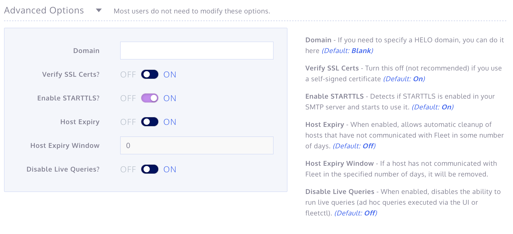

# Vagrant fleet

### Requirements

* Virtualbox
* Vagrant

## Run it

### Fleet Server:
```
$ vagrant up

$ vagrant ssh fleet

$ sudo su -

$ /usr/bin/fleet prepare db --mysql_address=172.17.0.1:3306 --mysql_database=fleet --mysql_username=kolide --mysql_password=potato --redis_address=172.17.0.1:6378 --server_cert=/root/keypair.crt --server_key=/root/keypair.key --logging_json --auth_jwt_key=changeme

$ /usr/bin/fleet serve --mysql_address=172.17.0.1:3306 --mysql_database=fleet --mysql_username=kolide --mysql_password=potato --redis_address=172.17.0.1:6378 --server_cert=/root/keypair.crt --server_key=/root/keypair.key --logging_json --auth_jwt_key=changeme &
```

* Access to the Fleet dashboard by opening your browser and heading to `https://192.168.48.10:8080/` (accept the self-signed cert and move on).

* First time you will need to setup a new user, password and email. Do it so.


* Move to the next page, make sure the address is the same than the server's private IP, this is necessary for the certificate we will download in a few moments.


* After configuring you will find yourself in the main dashboard


* Click on `Add new host`, copy the `enroll_secret` key and download the `server certificate` (copy the content as well).



* Before moving with the OSQuery node(s), head to the left under `Admin -> App Settings`.


* Head now to the bottom under `Advanced Settings` and disable `Verify SSL Certs` and then `Update Settings`.


* This is done. Now time to configure the OSQuery Node(s).


### OSQuery Node:
```
$ vagrant ssh osquery

$ sudo su -

$ echo "your_enrollment_secret" > /etc/osquery/enroll_secret

$ echo "server_certificate" > /etc/osquery/kolide.crt

$ osqueryd \
    --enroll_secret_path=/etc/osquery/enroll_secret \
    --tls_server_certs=/etc/osquery/kolide.crt \
    --tls_hostname=192.168.48.10:8080 \
    --host_identifier=uuid \
    --enroll_tls_endpoint=/api/v1/osquery/enroll \
    --config_plugin=tls \
    --config_tls_endpoint=/api/v1/osquery/config \
    --config_refresh=10 \
    --disable_distributed=false \
    --distributed_plugin=tls \
    --distributed_interval=10 \
    --distributed_tls_max_attempts=3 \
    --distributed_tls_read_endpoint=/api/v1/osquery/distributed/read \
    --distributed_tls_write_endpoint=/api/v1/osquery/distributed/write \
    --logger_plugin=tls \
    --logger_tls_endpoint=/api/v1/osquery/log \
    --logger_tls_period=10 &
```

* That should be it, you should see your host added on the main dashboard and use Fleet.


